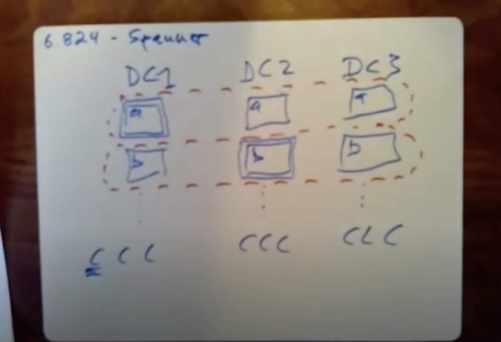
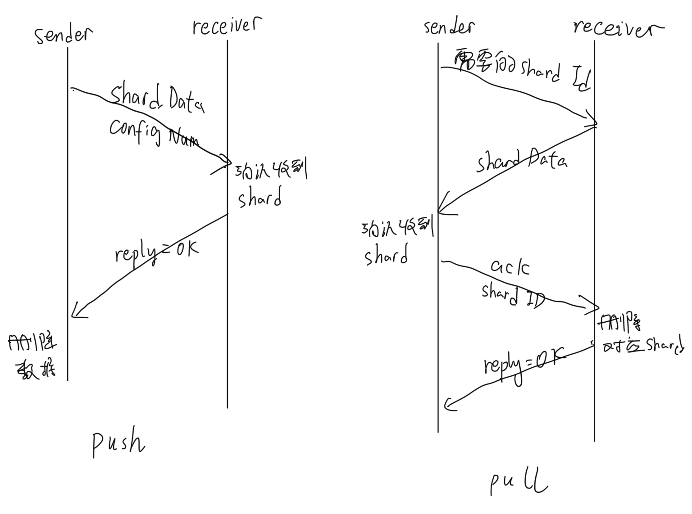

# My 6.824 Lab 2021 version
Lab2 link: https://pdos.csail.mit.edu/6.824/labs/lab-raft.html

## Lab 2: Raft
Raft paper: https://pdos.csail.mit.edu/6.824/papers/raft-extended.pdf

### Lab 2A: Leader election
Checkpoint saved in `branch: Lab_2A_rebuild`.

Lab2A由于第一版`branch: Lab_2A_Leader_Election`无法通过所有测试, 将第一版进行了重构, 主要的改变有：

1. 优化RPC请求, 对RPC进行了超时处理与异步化处理, 如在投票发起RequestVote RPC时, 为RPC设置超时上限(避免hung在已经disconnect的机器上), 同时发送RPC时采用异步发送的方式,单独启动一个异步协程进行发送和重试操作, 通过channel处理RPC结果。
   
2. ~~优化锁, 对变量进行修改均通过modify函数进行操作, 不在外部直接使用mutex, 因此对变量的变更类似原语, 保证了锁的粒度。此外通过使用命名锁的方式便于调试查看锁锁定的时间。~~没有对读加锁是完全错误的。

3. 优化协程同步模式, 对于定时器和其他操作, 原先使用sync.Cond时出现了很多问题, 因此将协程同步的方式改为了Channel, 定时器直接改为使用time.Timer。

### Lab 2B: Log
Checkpoint saved in `branch: Lab_2B_Log`.

基本实现思路按照Raft论文实现, ~~不过论文中给出AppendEntries的返回Reply仅有Term和Success两个参数, 我认为应该加上一个NextIndex参数便于Leader
更新matchIndex和nextIndex参数, 简单的为matchIndex加上len(args.Entries)是不正确的, 因为Follower在执行AppendEntries方法时不是从末尾Append的, 而是从
prevLogIndex处Append的, 如果在成功Append后在reply中加上表示Follower希望的下一个Index, 可以便于Leader正确的更新matchIndex和nextIndex参数。~~

当然最好的方法是将matchIndex和nextIndex在PrevLogIndex的基础上加上len(args.Entries), 经过测试, 这种方式不需要修改AppendEntries的参数, 且可以正常通过全部测试。

### Lab 2C: Persistence
Checkpoint saved in `branch: Lab_2C_Persistence`.

#### Dec 19:
主要基于6.824助教写的debug文档 https://thesquareplanet.com/blog/students-guide-to-raft/ 进行debug

#### Dec 20:
经过与其他人正确的代码进行比对, 导致`TestFigure8Unreliable2C`测试一直无法通过的原因可能是：
1. 锁的问题, 之前仅对变量修改加了锁, 对读没有加锁
2. channel变量设计问题, 其他人往往不会对AppendEntries设计一个Channel, 这个Channel可能会影响结果的正确性
3. 应该将用于处理发送ApplyMsg管道的协程和处理选举管道的协程分离开(Make函数中), 否则可能影响效率
4. 代码逻辑问题

#### Dec 21:
以下是最终确定并fix的我的代码中存在的问题, 经过确认, 这些问题都会导致`TestFigure8Unreliable2C`测试无法通过:

1. AppendEntries中忘记了重置State为Follower, 修改Term值为args的值(如果大于自己),以及重置选举计时器。

2. 实现论文要求的选举等待时间有误, Raft论文要求在选举开始前等待一个随机时间后再开始选举, 但其实这个等待过程不需要在startElection这个方法中手动的去通过time.Sleep来完成, 我们仅需要通过在reset选举Timer时在一个基础值上加上一个随机值, 就相当于完成了随机等待这个过程。使用在startElection后手动sleep则需要在sleep完成后再次检查相关变量是否符合选举开始的条件, 显然这是一个非常失败的设计。

3. 锁的问题, 使用modify方法仅对变量写加锁是完全错误的做法, 且用lock锁住的临界区不应该包含RPC调用、time.Sleep等任何存在耗时过程的代码, 在测试时应使用go test -race参数来检查数据争用问题。

4. 在Leader发送AppendEntries RPC完成后, 更新其自身CommitIndex值时, 一个优化性能的点。由于按照要求当CommitIndex被更新时, 需要向ApplyMsgCh发送ApplyMsg表示确认该Entry被写入集群成功, 在这里检查时我每当CommitIndex被加1就发送一条ApplyMsg, 经检查这样会大幅降低该过程的执行速度, 而hasChanged这个标志位可以降低sendApplyMsg方法被调用的次数。

5. 根据助教写的debug指南, 发现之前的RequestVote存在逻辑漏洞, 例如确定投票给出后, 应该立即重置选举计数器; 如果自己是leader, 则应直接拒绝投票; 如果args中的Term大于自己则无论为什么state都需要自降为Follower, 这些逻辑在之前的代码里没有被if覆盖完整导致出现了问题。

6. 应专门开设一个协程用于发送ApplyMsg到ApplyCh, 同时在发送时获取锁, 保证向ApplyCh发送是完全串行的, 不能将发送ApplyCh功能的协程和发起选举或投票的协程混用, 否则会导致ApplyMsg发送不及时而无法通过测试。

#### Lab2C debug总结
经过这几天的dubug, 没有想到自己的代码竟然有这么多问题, 过程虽然很痛苦, 但是完成后还是非常有成就感的。其实这个`TestFigure8Unreliable2C`就是一个照妖镜, 之前Lab2a、Lab2b的测试其实很容易就可以通过, 并不能发现代码中存在的问题, `TestFigure8Unreliable2C`主要检测Raft集群能否快速的在网络出现长时间故障, 恢复后能否在10s内达成共识, 且会对刚完成写入的leader进行disconnect, 这个测试可以说是一个比较完整的测试了, 对性能也有一定的要求。我出现的那些问题大部分也不是玄学问题, 基本上就是逻辑漏洞, 写并发代码的能力还需提高。

### Lab 2D: Log compaction
Checkpoint saved in `branch: Lab_2C_Persistence`.

2D 部分是2021版新加入的, 这个部分我花了很多时间才弄清楚Snapshot/InstallSnapshot/CondInstallShot三个RPC具体的含义和处理逻辑, 在后文会对整个Raft的内部和外部调用进行整理。

主要Debug过程：

1. TestSnapshotInstall2D无法通过: sendAppendEntriesToFollower函数中忘记在正常的返回时修改跟随者NextIndex。

2. TestSnapshotInstallUnreliable2D无法通过: 在AppendEntries函数中如果reply.NextIndex == rf.Log.LastIncludedIndex, 同样也应该发送InstallSnapshot RPC。

3. TestSnapshotInstallCrash2D无法通过: peer crash从快照恢复后, 应将lastApplied修改为LastIncludedIndex, 直接置为0可能会导致活锁现象。

参考资料：

https://zhuanlan.zhihu.com/p/425615927

https://www.cnblogs.com/sun-lingyu/p/14591757.html

### Raft Milestone Review

Function fast review:

1. RequestVote: 内部RPC, 当ElectionTimer超时后, 任何Follower和Candidate都会发起一次选举, 即使现在已经在选举Candidate状态也会发起一此新的选举。选举过程中Candidate会向所有人发送RequestVote RPC, 在验证Candidate身份(term和index必须不能比自己旧)后, 被调用方才会把票投过调用方, 并重置自己的选举计时器。

2. AppendEntries: 内部RPC, 当属于某个Follower的SendTimer超时后, Leader会根据自己维护的nextIndex切片查找该Follower的nextIndex, 将自己所有的在其nextIndex后的logEntries发送给该Follower。AppendEntries被调用方会检查调用方的合法性, 如果合法就会重置自己的ElectionTimer,然后会检查发送的entries能否被正确拼接, 在找到和prevLogTerm和prevLogIndex匹配的位置才会执行拼接, 原先的entries会直接被覆盖。优化后的AppendEntries会返回Follower希望收到的NextIndex, 可以帮助Leader快速更新属于该Follower的next和match index, 同时Leader会检查所有Follower的matchIndex, 过半数的Follower的matchIndex大于一个值后就将自己commitIndex修改为这个值, 确定成功后AppendEntries还会重置这个Follower的SendTimer。

3. Start: 外部调用, 调用方会遍历所有peer, 直到找到Leader, 调用方会发送一条指令给leader, leader会将该指令加入自己的logEntries。

4. GetState: 外部调用, 用于检查集群节点状态。

5. InstallSnapshot: 内部RPC, 当Leader完成对Follower的AppendEntries, 如果这个Follower返回的NextIndex的值小于该Leader的LastIncludedIndex(相当于这个Follower没有达到上一个快照点), 就会给这个Follower发送这个快照。InstallSnapshot接收方并不会立刻装载这个镜像, 而是先在ApplyCh中发送将要装载这个镜像的请求发送到上层状态机，上层状态机通过CondInstallSnapshot与Raft层一起原子地完成镜像的装载。

6. CondInstallSnapshot: 外部调用, 这个方法是为了保证镜像装载的原子性, 因为在创建快照时不仅包括Raft层的快照信息，还包括Server层的快照信息, 我们在装载快照时上层状态机希望和Raft层同时切换到一个快照点，因此通过该调用保证装载时能够同步地完成切换。

7. Snapshot: 外部调用, 当Server层希望创建一个镜像时, 会通过这个调用告诉Raft层希望快照的index, 并会将Server层和Raft层的所有需要保存的数据一并存入persister。

## Lab 3: Fault-tolerant Key/Value Service

### Lab 3A: Key/value service without snapshots

Checkpoint saved in `branch: Lab_3A_KV_WIO_Snapshots`.

#### 主要设计思路

使用Raft作为底层来完成kvServer, 集群里的每台机器都维护一个kvMap, 但仅由Leader响应Client的Get/Put/Append, 集群的非Leader机器仅通过applyCh返回的Op(相当于已经被Leader Commit过)来维护自己的kvMap, 因此无论是Leader还是Follower都需要使用一个协程来处理Raft层applyCh返回的数据。作为Leader的kvServer同时还会维护多个waitCh, 用于给Get/Put/Append等RPC回传Operation结果, 这些RPC在从waitCh收到Operation结果后才会给Client返回结果。

#### 请求去重

通过版本号机制解决, 针对每一个ClientID, 我们在一个Map里保存属于该Client的收到的请求的最大版本号。请求去重主要通过两个位置拦截, 一个是Leader Server端的Get/Put/Append RPC内(因为正常情况非Leader会直接返回ErrWrongLeader), 通过我们维护的versionMap来保证不会收到重复的请求。另一个地方是在响应applyCh的协程里, 在我们根据收到的Op数据修改我们的kvMap前, 同样需要检验该Op的Version是否大于之前保存的该ClientID对应的版本号, 这是为了防止由于某些特殊的网络故障导致重复的Op被发送到Raft中, 版本号仅会在Op成功执行后才会被更新。

#### 性能优化(For SpeedTest3A)

2021版的6.824的Lab 3新加入了一个针对本实验的kv的性能测试, 要求平均读写(写一条然后读取)时间小于33ms, 这个测试我花了几乎一天时间性能调优才通过。我发现在运行时测试时CPU的占用率很低, 说明瓶颈是由于某些同步原语等待导致的。我使用了golang的pprof工具来查找问题, 可以通过在go test后加上参数`-bench=. -blockprofile=block.prof -mutexprofile=mutex.prof`来生成性能评估文件, block.prof是阻塞等待的时间消耗而mutex.prof是锁的时间消耗, 我们可以使用`go tool pprof -http=:8080 block.prof`来以图形化的方式打开这些性能评估文件, 可以清晰的显示每行代码的时间消耗。评估显示我们的代码在等待发送AppendEntries的计时器超时处花了非常久, 这个SpeedTest3A是一个串行的测试, 只有确定写入操作成功完成并可以读出后(需要等待这个Op被半数以上commit)才会发送下一条指令, 这个指令等待被AppendEntries发送到其他Follower的时间(之前的设计是等待心跳计时器超时才会发送)就是我们的瓶颈所在。我通过在写入Raft的入口方法Start处加入一个channel来通知Leader一条指令被写入, 负责向其他Follower发送AppendEntries的协程收到channel通知后会立刻发送AppendEntries。经过这个修改, 我的读写延迟降低为了1ms左右, SpeedTest3A的1000条读写指令对仅需要1.3s。

### Lab 3B: Key/value service with snapshots

本轮实验较为容易, 加上了一个对Raft状态大小的判定, 如果当前的状态超过设定的阈值Server层就会发起一个Snapshot调用；对于落后于快照的peer, 则需要通过InstallSnapshot调用为其安装当前Leader的快照(和2D部分相同), 该peer会向applyCh发送一个snapshot请求, Server层收到该请求后向raft层发起CondInstallSnapshot调用, raft层就会安装该Snapshot。

## Lab 4: Sharded Key/Value Service

### Lab 4A: The Shard controller

本轮实验的coding难度不高, 有了Lab3的基础基本上可以很顺利的完成。主要思路是在每台机器上维护相同的config状态机, 需要注意的一个坑是在shard需要重新balance的时候, 我们需要找一台目前已经被分配的shard最少的gid, 这时我们需要使用一个map来记录每个gid当前已经被分配了多少个shard, 在寻找最少的那个gid时, 我们不能简单的随意取一个值最小的, 因为golang的map在迭代时顺序是被刻意打乱的, 在每台机器上访问的顺序都不一致, 如果我们只是选择值最小的gid, 那么在每台机器上选择的gid可能会不一致, 导致最终各台机器上的状态不一致。所以我们在选择gid时需要加上一个条件, 即值一致时选择gid更小的那一个, 这样就可以保证在不同机器上选择的gid也是一样的了。

### Lab 4B: Sharded Key/Value Server With Challenge 1 & 2

#### 架构设计

由于我一开始准备一步到位完成Challenge 1和2, 所以花了大概3天时间思考代码的设计架构, 实话说本部分实验作为课程的期末作业还是很有难度的。为了满足Challenge 1和2给定的分片清理和分片独立迁移的功能, 看了网上博主关于这个问题的理解后, 我觉得可以通过以下几点来保证能够通过所有test和challenge, 保证实现时的数据安全性：

##### Shard状态设计

无论是采用pull还是push模式, 由于Challenge 2要求在分片数据迁移时各个分片相互独立, 未处于迁移过程中的分片读写不能受到影响, 因此将不同的Shard独立成单独的结构是非常必要的。这里我们需要为Shard设计一个状态位来标志其状态, 以push为例, 我们会需要Regular, Pushing, WaitPush三个状态：

1. Regular: 默认的状态, 无论本raft组管理该分片与否, 在默认情况状态下都处于该状态, 如果根据config本Shard归属于本raft组管理则正常提供服务。此外, 如果所有分片都处于该状态下则不会阻塞Config的更新。

2. Pushing: 如果config在update时发现前一个版本中的某个分片在新的版本不存在了, 即迁移到其他raft组去了, 我们就可以将这个group的状态标记为Pushing。此后这个分片就不会提供读写服务了, 读写会直接返回ErrWrongGroup。在迁移协程扫描到这里时, 会发起向目标group发起PushShard RPC, 当我们收到OK的Reply之后, 即可以立即删除该Shard在本地的数据。

3. WaitPush: 如果config在update时发现新版本出现了旧版本中未曾出现的分片, 则将对应分片置为WaitPush状态, 等待接收push RPC。

##### Config更新时的安全性

有一个很极端的情况, 如果一个raft组有半数以上的机器挂了(即这个raft组对外表现为不可工作状态), 那么可不可能集群里的其他机器更新到一个新的config后, 这个还位于旧版本的raft组recover了, 拉取新的config之后某些分片处于WaitPush的状态, 但由于其他raft组已经位于新的config下, 所以这个落后的raft组会一直无法完成更新config。

这个问题我思考了很久, 这个问题的解决方案是：我为Shard加上了一个WaitPush状态, 同时确定了Config更新的条件：当所有分片都为Regular状态时, 才能更新到下一个版本的Config。通过这两点我们就可以保证Config更新的原子性, 一旦一个raft组从controller处拉取了下个版本的config, 无论它本轮是Shard的接收方还是发送方或二者皆有, 在完成分片的交换前它都无法更新到下个配置(WaitPush是制约接收方的, 如果它发现本轮要接收分片就必须等待分片到达才能继续更新Config)。由于这个限制对于接收双方都存在, 如果一个raft组对外表现为不工作状态, 那么所有依赖其数据的raft组无论是要发给它还是需要它的分片, 全部都会停留在当前config上, 形成一个故障raft组集合(其实分片读写还是ok的, 只是配置不会更新了)；如果后续还有config更新, 则所有和这个故障raft组集合中任意raft组有分片交换需求的raft组都会无法更新config, 最终甚至可能所有raft组都无法更新配置。

其实对外看来, 整个multi-raft集群真正出现读写故障的只有最初那个raft组上的分片, 以及更新config版本的故障, 在生产环境中这种仅一个raft组出现故障的概率其实很低。这个Lab4实验据Morris教授所说, 原型是Google的Spanner, 在6.824这一课程中我们曾读过Spanner的论文, 在Spanner中每个Paxos组的物理机都位于多个DataCenter, 而不同的Paxos组下层DataCenter组是一致的, 很可能一个DataCenter拥有属于不同Paxos组的多个实例, 而一旦出现了一个Paxos组大部分机器都crash也很可能意味着多个不止一个Paxos组crash了, 这种情况自然也超过了multi-raft集群安全性的讨论范围。

##### 分片清理和迁移的安全性

首先需要讨论的是分片迁移时, 是选择pull还是选择push的问题, 我认为push是优于pull的, 这是因为在我们使用pull RPC时, 数据是在Reply中返回给Shard接收方的, 但作为发送方我们无法确认这个Reply对方到底接收成功没有。因此在采用pull方式时我们还需要设计一个ack RPC, 在Shard接收方收到pull RPC的Reply后, 再给对方发送一个ack RPC, 表示之前发送的分片可以删除了, 这时Shard发送方才能删除之前的分片数据。

而push模式则没有这个问题, Shard发送方主动的在push RPC的Args中发送分片数据给接收方, 接收方在确认数据收到后才会返回这个reply, 接收方收到RPC的reply后马上就可以删除这个之前的分片, 少了一个RPC。就算这个接收方返回的reply没收到, 发送方重新push了, 我们也可以根据分片的状态和config版本号来确认：只有当push Args中发送方的Config版本号和当前自己的版本号一致, 且该分片处于waitPush状态才会接收这个push传来的数据。这样就保证了数据迁移的安全性。

至于分区清理的安全性, 由于采用了push模式, 只要分片发送方收到push RPC的reply, 即可认为数据安全到达, 此时立即删除分片数据即可, 不必和pull模式一样再设置一个ack RPC, 收到确认后再进行删除。

#### Debug:

本实验主要的bug围绕以下几点:

1. 关于发送Push RPC Config版本号的验证: 在之前的版本，我将这个RPC Config版本号验证的位置放在了Push RPC接收的入口处, 当Leader收到一条和自身Config版本号相同的PushShard请求，且自身的Shard状态为WaitPush，就立刻给Push发送方返回OK。这种设计存在一个缺陷，假如目前场上原先的Leader被孤立了，根据raft选举机制场面上会出现一个多数派Leader和少数派Leader，当我们作为发送方，发送Push RPC如果少数派的Leader接收到了我们的PushShard，少数派会返回一个无效的OK给调用方，这会导致调用方错误的GC了原先的需要push的数据片，而现在该group真正的多数派leader却没有收到。中间我改为返回过OK的Group大于等于1才进行GC，发现同样无法成功，可能还是少数派Leader的错误回复导致。其实这个问题的核心在于对状态机的流程思考不深入导致的，事实上无论是PutAppend，还是配置更新和分片迁移，group的Leader仅仅是这个操作的发起者，真正执行的时刻是要在raft集群半数以上的机器Commit这个操作，并通过applyCh返回到上一级时。那么我们如何确认这个PushShard操作的日志真正被raft的半数以上机器commit了，是在多数派Leader通过applyCh收到这个Push时，因为少数派Leader的Start因为网络分区的原因提交是不可能获得半数以上支持的，因此正确的设计是当多数派Leader通过applyCh收到Push的日志才会给Push RPC发起方返回OK。

2. 循环变量在协程内的作用范围: 如果我们将for-each的迭代变量直接在协程内使用，会导致协程内部的变量出现混乱，因为编译器在处理协程内出现的外部变量时，采取的是传址的方式，外部变量的变化会导致内部变量出现变化，因此我们需要将这些变量以协程参数的形式传入。

3. 数据的深拷贝问题: 在使用RPC传递和Raft发送的日志时，我们需要重新对数据进行深拷贝后再进行使用。

4. Lab 4B需要保证所有操作的幂等性，在apply 迁移操作/GC操作/更新版本操作时(Op操作也会通过去重表保证幂等性, 因为重试发送的push是不会增加版本号的)，我们需要确定这个操作是属于当前版本的config，且状态位必须是正确的，更新版本版本更新号必须只能更新到当前版本号+1等；究其原因是因为在网络不可靠的环境下所有操作都可能发生重试(这些重试也会记录在WAL中)，我们必须保证所有操作都是适用于当前状态机状态的，这就是保证线性化语义的精髓